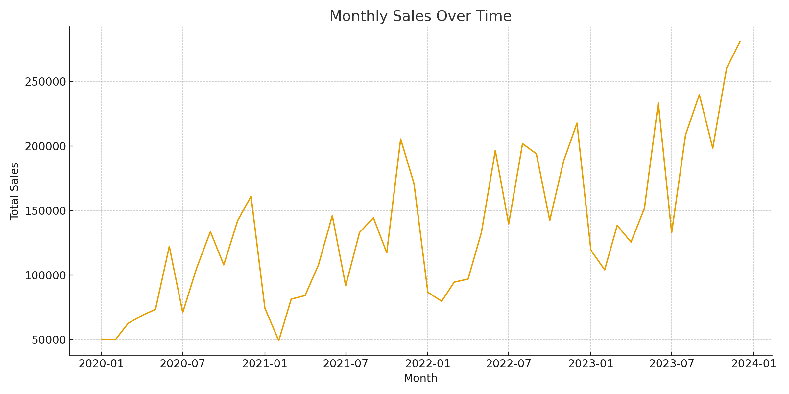
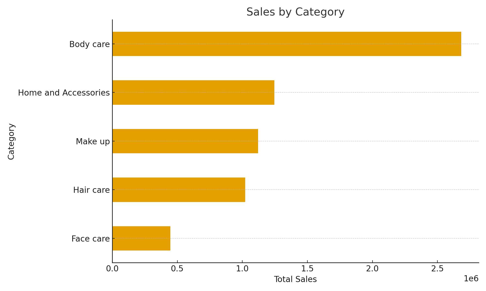
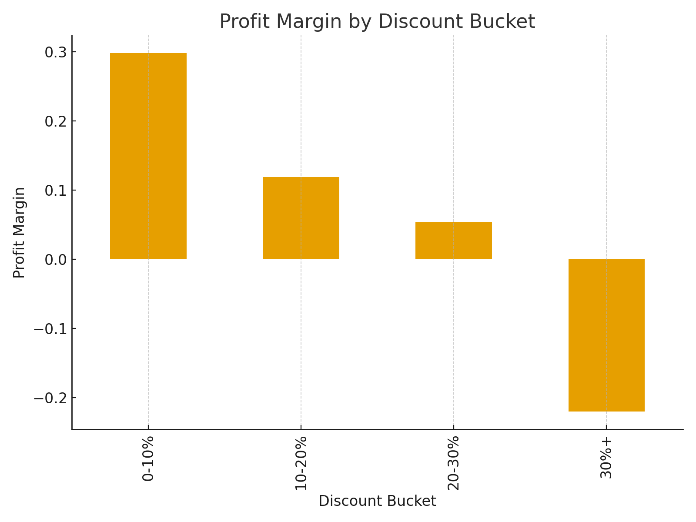
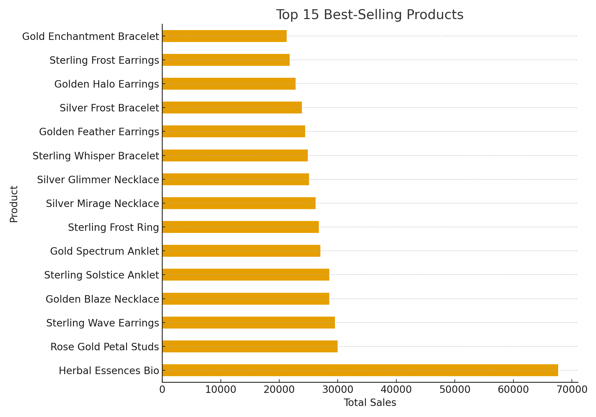
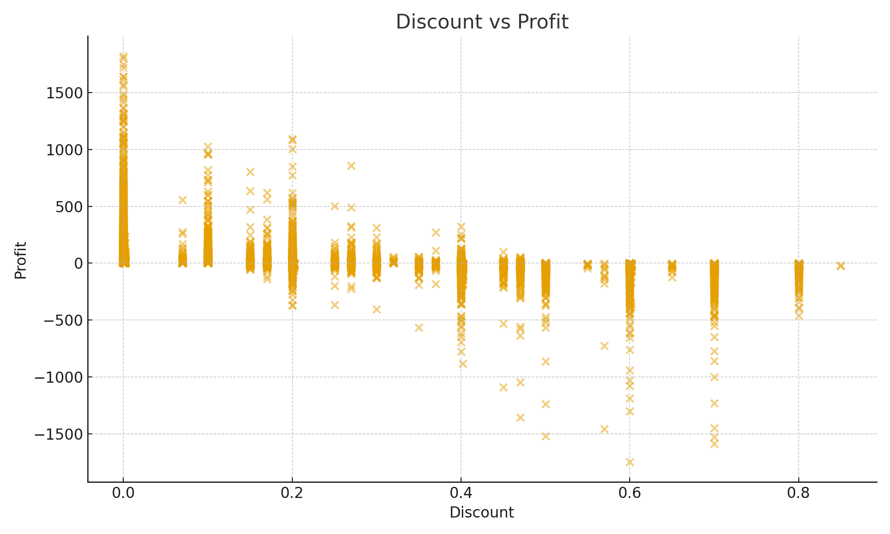
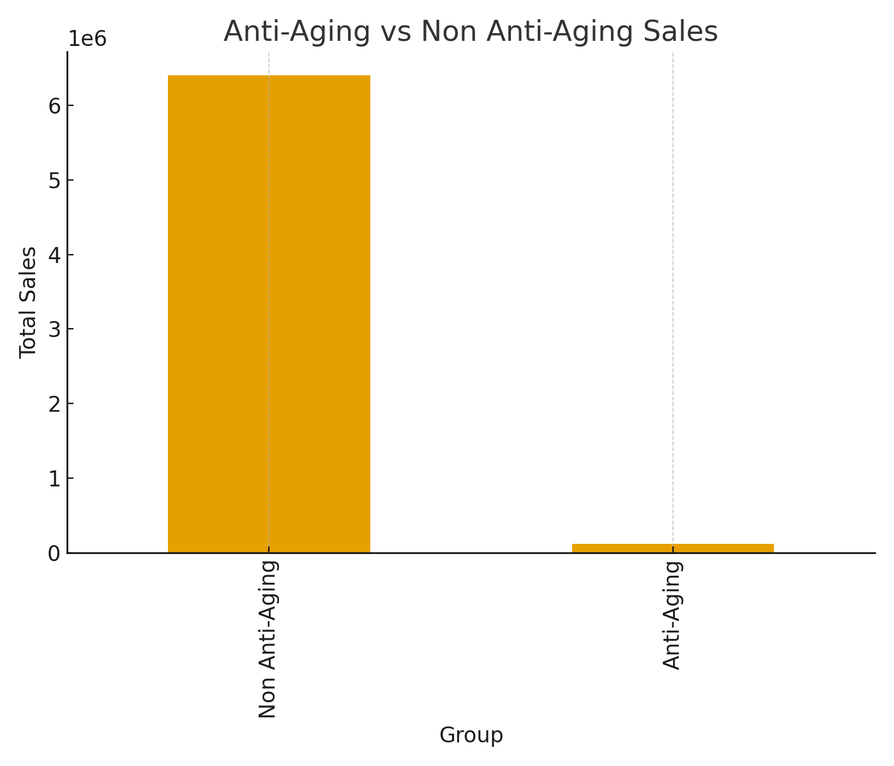
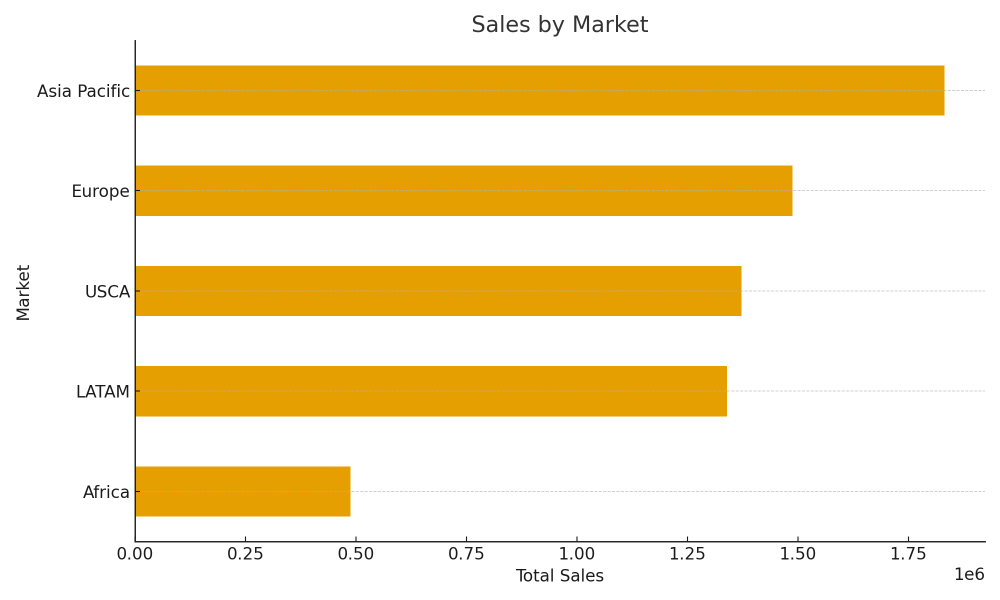

# 🧴 Global Skincare E-Commerce — SQL Analytics Project

This project analyzes a real-world skincare e-commerce dataset (51K rows) containing detailed product, category, sales, discount, and profit information.  
Using SQL, I explored category performance, discount impact, customer behavior, anti-aging trends, profitability, and geographic insights.

---

## 📦 Dataset Overview

**Rows:** 51,290  
**Columns:** 19  
**Source:** Global Skincare & Beauty E-Store Dataset  
**Formats:** data.csv + dictionary.csv

**Key Columns:**
- Order ID  
- Order Date  
- Customer ID  
- Category / Subcategory  
- Product  
- Sales  
- Profit  
- Discount  
- Country / Region / Market  

Dataset path:  /dataset/data.csv

---

## 🎯 Business Questions

1. Which product categories generate the most sales and profit?  
2. Which subcategories lead in performance across the store?  
3. What is the relationship between discounts and profitability?  
4. How strong is the anti-aging market segment?  
5. What is the repeat customer rate?  
6. Which markets and regions perform best?  
7. What are the best-selling products overall?

---

## 🛠️ Tech Stack

- **SQL (PostgreSQL style)**  
- **Data Modeling**  
- **Window Functions**  
- **CTEs**  
- **Aggregations / Joins**  
- **Markdown reporting**  

---

## 📊 Key Findings (from `insights.md`)

### **Overall KPIs**
- **Total Sales:** \$6.52M  
- **Total Profit:** \$1.06M  
- **AOV:** \$253.33  
- **Repeat Customer Rate:** 31.2%  
- **Average Discount:** 14.3%  

### **Category Insights**
| Category | Sales | Profit | Margin |
|----------|--------:|---------:|---------:|
| Body Care | \$2.68M | \$590K | 22.0% |
| Make Up | \$1.12M | \$369K | 32.9% |
| Face Care | \$445K | \$159K | **35.7%** |
| Hair Care | \$1.02M | \$3.6K | 0.36% |
| Home & Accessories | \$1.24M | **-57K** | **-4.6%** |

👉 **Home & Accessories is unprofitable**  
👉 **Face Care + Make Up are high-margin growth areas**

### **Discount Impact**
- Discounts above **30% → -22% margin (loss-making)**  
- Healthy margin at: **0–10% discounts**

### **Anti-Aging Segment**
- Sales: **\$140K** (2.15% of total)  
- Opportunity for high-margin product expansion

---

## 🧩 SQL Structure

All SQL queries are inside:  /sql/queries.sql

The analysis includes:  
- Data quality checks  
- KPIs  
- Category performance  
- Anti-aging segment analysis  
- Discount–profit elasticity  
- Cohort logic  
- Customer repeat behavior  
- Market-level insights  
- Pareto (20/80) revenue distribution  

---

## 📈 Visualizations

### 1. Monthly Sales Over Time
Shows the total sales trend across months, helping identify seasonality and growth patterns.  

### 2. Sales by Category
Displays revenue distribution across all product categories.  

### 3. Profit Margin by Discount Bucket
Illustrates how increasing discounts affect profit margin.  

### 4. Top 15 Best-Selling Products
Ranked bar chart showing the top revenue-generating products in the store.  

### 5. Profit by Category
Highlights which categories generate the highest and lowest profit.  

### 6. Discount vs Profit (Scatterplot)
Explores the relationship between discount levels and line-level profitability.  

### 7. Anti-Aging vs Non Anti-Aging Sales
Compares total sales volume between anti-aging products and all other products.  

### 8. Sales by Market
Shows sales distribution across different markets/regions.  

